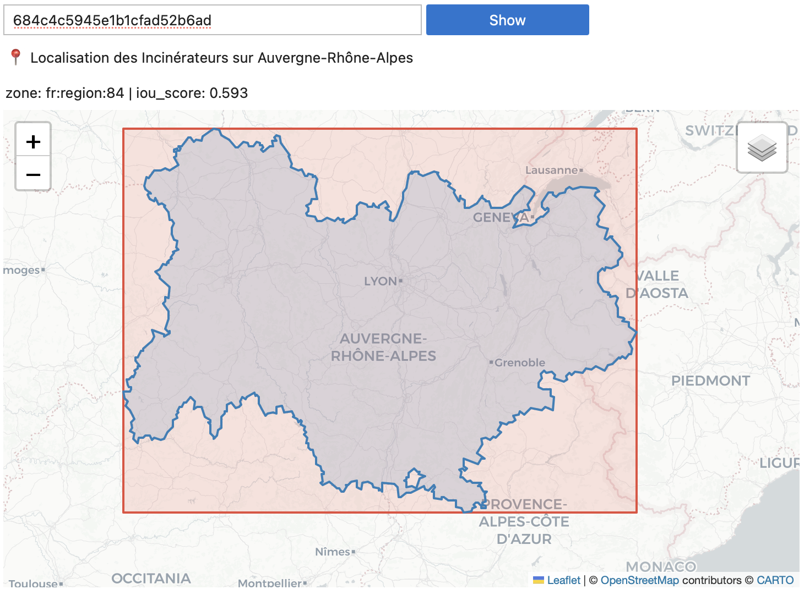

# GeoZones mapping

Matches data.gouv.fr datasets that have a bounding box (`spatial.geom`) to the best-fitting
administrative zone (région, département, commune, EPCI…) using IoU scoring.

Two approaches are implemented and compared — see [Comparison](#comparison) below.

## Notebooks

### Zone preparation (run once, in order)

#### 1. `geozones-global.ipynb`

Downloads the [geozones archive](https://www.data.gouv.fr/api/1/datasets/r/4ec9e77d-572a-40f9-9940-ade023ce8b78)
and extracts the 6 top-level geographic containers (world, EU, France, France métro, DROM, DROM-COM).

**Output:** `zones_global.geojson`

#### 2. `geozones-filtered.ipynb`

Downloads the [export-geozones dataset](https://demo.data.gouv.fr/api/1/datasets/r/7971e15c-3255-4724-b690-77171bc6d9ad)
(French territorial zones: régions, départements, EPCIs, communes) and combines it with
`zones_global.geojson`.

**Output:** `zones_filtered.geojson`

#### 3. `geozones-generate-bboxes.ipynb`

Converts `zones_filtered.geojson` to a lightweight JSON mapping of zone ID → bounding box.
Only needed for the bbox matching approach.

**Output:** `zones_bboxes.json`

---

### Method 1 — Actual geometry matching (`geozones-mapping.ipynb`)

Downloads the [datasets export](https://www.data.gouv.fr/api/1/datasets/r/f868cca6-8da1-4369-a78d-47463f19a9a3),
then for each dataset with a bounding box finds the best-matching zone by comparing the dataset
bbox against the **actual zone geometry** (not its bounding box):

- `sjoin(predicate='intersects')` for candidate pairs (~130M)
- area-ratio pre-filter (lossless, reduces to ~170K candidates)
- actual `shapely.intersection` IoU on remaining candidates
- best match must satisfy IoU ≥ 0.4 and zone area ≤ bbox area

**Output:** `geozones-mapping-output.csv` — **32,338 datasets matched** out of 45,424 with a bounding box.

| Level | Count |
|---|---|
| `fr:departement` | 14,657 |
| `fr:region` | 8,390 |
| `fr:commune` | 7,358 |
| `fr:epci` | 1,197 |
| `country-subset:fr` | 680 |
| `country:fr` | 56 |

---

### Method 2 — Bbox matching (`geozones-mapping-bboxes.ipynb`)

Same pipeline but compares the dataset bbox against the **zone bounding box** instead of the
actual geometry. The premise: when a dataset's spatial bbox was set to cover a specific zone,
it should be nearly identical to that zone's bounding box.

- Zone geometries replaced by their bounding boxes (from `zones_bboxes.json`)
- Dataset geometries reduced to their envelope if not already a bbox
- IoU computed with pure arithmetic (no `shapely.intersection`) — much faster
- Threshold set to IoU ≥ 0.8 (high confidence: we're comparing near-identical rectangles)

**Output:** `geozones-mapping-bboxes-output.csv` — **29,219 datasets matched** at threshold 0.8.

---

## Comparison

`geozones-mapping-comparison.ipynb` diffs the two outputs and samples from each group.

Results with method 1 (IoU ≥ 0.4) vs method 2 (IoU ≥ 0.9):

| Group | Count |
|---|---|
| Same zone matched by both | 27,792 |
| Different zone matched by both | 85 |
| Only by actual geometry | 4,468 |
| Only by bbox | 1,342 |

**Only matched by actual geometry (4,468):** These are approximative matches where the dataset
bbox partially overlaps the zone but doesn't align with its bounding box. Losing them with the
bbox approach is acceptable — they were never precise matches.

**Only matched by bbox (1,342):** Precise local datasets (PPR/PPRN, orthophotography,
servitudes) whose bbox aligns perfectly with a commune or département. The actual-geometry
approach missed them because irregular zone boundaries (crenelated, coastal) dragged IoU below
0.4 despite the dataset being clearly scoped to that zone. These are genuine good catches
unique to the bbox approach.

**Different zone (85):** Two recurring patterns — DOM-TOM region/département ambiguity
(Martinique, Guyane, Réunion each have a région and a département with the same geography),
and EPCI vs commune mismatches where the bbox approach tends to pick the more granular level.

### Which to use?

The bbox approach is faster, more conservative, and excels at precisely-scoped datasets.
The actual-geometry approach catches more matches overall but includes looser fits.
Combining both (union) would give the broadest coverage; intersecting (same zone in both)
gives the highest confidence.

---

## Tools

- `geozones-debug.ipynb` — interactive map to inspect individual dataset matches (actual geometry matching)



## Running

```bash
uv run jupyter lab
```

All downloads are skipped if the files already exist locally.
